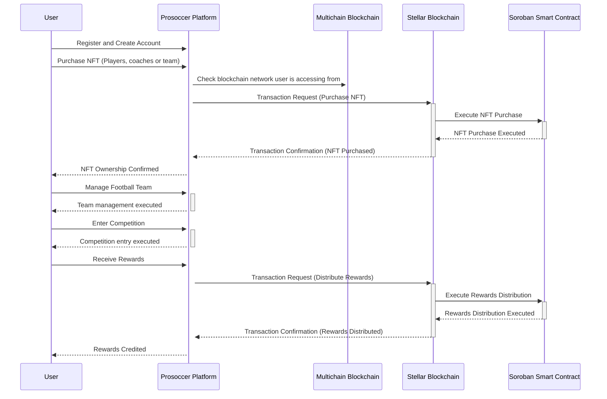

# Prosoccer Project Technical Documentation

## Overview

Prosoccer is the first multi-chain digital football platform that empowers soccer fans to own, trade, manage soccer teams and play in competitions.

## **Technical Architecture Diagram**

# Explanation

## User Registration and Wallet Creation

1. The user registers on the Prosoccer platform using their preferred chain (Stellar blockchain)
2.

## Purchasing a Football Team NFT

1. The user purchases their digital assets (players, coaches or team) on the platform.
2. The platform check the chain the user is accessing from (Stellar blockchain)
3. The platform sends a transaction request to the Stellar blockchain.
4. The Soroban smart contract executes the NFT purchase.
5. The transaction is confirmed, and the platform notifies the user of their NFT ownership.

## Managing Football Team

1. The user manages their football team through the platform.
2. The platform execute the team management request.

## Entering Competitions

1. The user enters a competition.
2. The platform execute the competition entry request.

## Receiving Rewards

1. The user receives rewards for participating in competitions.
2. The platform sends a transaction request to the Stellar blockchain.
3. The Soroban smart contract executes the rewards distribution.
4. The transaction is confirmed, and the platform notifies the user.
